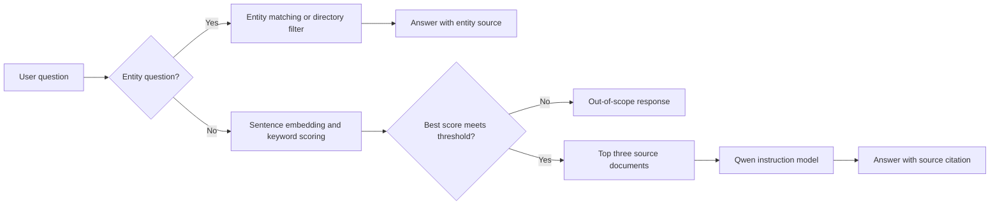

# Rwanda Tourism Guard AI

## Project report

### Run locally

From the project folder in PowerShell:

```powershell
& ".\.venv\Scripts\python.exe" -m streamlit run app.py
```

### Problem and objective

People may need to find information in Rwanda's tourism legislation or check
basic details about a tourism business. This project provides a local
question-answering application over the tourism-law documents and the
tourism-entity records included with the project.

The application is an information and demonstration tool. It is not legal
advice, does not establish the current legal status of a business, and cannot
guarantee that its source snapshots are complete or up to date.

### Selected AI approach

The project uses retrieval-augmented generation (RAG) for tourism-law
questions. It combines:

- **Document retrieval:** the English tourism law is split into article-sized
  chunks. The chunks and entity profiles are encoded using
  `sentence-transformers/all-MiniLM-L6-v2`.
- **Hybrid ranking:** normalized embedding similarity is combined with a
  lexical keyword-overlap score to select relevant source documents.
- **Answer generation:** the top three retrieved documents are supplied as
  context to the pretrained `Qwen/Qwen2.5-0.5B-Instruct` model. Answers are
  limited in length and cite the selected source documents.
- **Deterministic entity tools:** exact entity questions and supported
  category/district list questions are answered from the local entity table,
  without generating an LLM answer.
- **Out-of-scope guard:** weak retrieval scores are refused rather than sent
  to the language model.

Training a language model from scratch is not required for this approach.

### Architecture



### Data preparation and implementation

The repository contains source PDFs and collected entity/profile data in
`data/raw/`, prepared files in `data/processed/`, and the ready-to-use
document/embedding store in `data/vector_store/`.

The processing pipeline extracts English law text, creates article chunks,
cleans and enriches tourism-entity records, combines these into retrieval
documents, then builds normalized embeddings. Entity lookup additionally
normalizes name tokens, corrects likely misspellings, detects question
intents, and filters entity listings by district/category.

Answers about a named entity are shown in a field/value table, with available
website and official RDB-profile links as buttons. Category/district search
results use a structured business table with the available fields from each
local dataset record, including phone and email where permitted. Long
descriptions are omitted. List answers show details for at most 15 matches.
Individual tour-guide contact details remain hidden.

The included prepared data has 53 law articles and 1,027 tourism-entity
records. The local model directories and retrieval settings are stored in
`models/` and `config.json`. Core implementation is in
[`src/rag.py`](src/rag.py); the Streamlit interface is in
[`app.py`](app.py).

The home dashboard focuses on the question assistant and a searchable
directory. Users can filter by business name, entity category, district, and
licence status, view a profile, see available contact details for non-guide
businesses, and open the source tourism-portal record.

Questions and answers are kept in Streamlit session state and can be reopened
from the **Session history** panel in the left sidebar. This history lasts for
the current browser session and is not saved across sessions.

### Evaluation

The evaluation code is [`src/evaluate.py`](src/evaluate.py), and the saved run
is [`evaluation_results.json`](evaluation_results.json). The recorded results
are:

| Criterion | Recorded result |
|---|---:|
| Retrieval Hit@1 / Hit@3 / Hit@5 | 1.00 / 1.00 / 1.00 |
| Mean reciprocal rank (MRR) | 1.00 |
| Answer checks passed | 4/4 |
| Musanze entity-list grounding check | Pass |
| Answers with a source citation | 5/5 |
| Out-of-scope refusal checks passed | 3/3 |
| Average response time across the evaluation cases | 7.75 seconds |

Retrieval was checked against 16 prepared law questions. Answer correctness
uses expected keywords for four questions, and the refusal check uses three
out-of-scope prompts; these are useful smoke tests, not a comprehensive
independent accuracy study. The 7.75-second average combines different paths:
entity lookups/refusals can be much faster than generated law answers. In the
saved run, the two measured law-generation answers took about 18 seconds each.
Results depend on the computer running the local models.

Repeatable deterministic application tests are in `tests/test_rag.py`; run
them with the command in the demonstration section below.

### Responsible use, risks, and limitations

- **Outdated or incomplete sources:** the bundled law and entity data are
  project snapshots, and their collection date is not recorded in the app.
  Verify current legislation against official publications and business
  details against the relevant Rwanda Development Board source.
- **Incorrect generated answers:** a small language model can misunderstand
  retrieved text or produce an incomplete answer. Source citations and an
  out-of-scope refusal help users verify responses but do not guarantee
  correctness.
- **Not legal advice:** do not use the application as a substitute for
  official guidance or qualified legal advice.
- **Narrow coverage:** the current source set supports Rwanda tourism-law
  questions and questions about the included tourism-entity records. It does
  not provide a sourced guide to responsible tourism, general travel advice,
  or every tourism-related regulation. Those topics should not be presented
  as supported until suitable documents are added and evaluated.
- **Local resource use:** model loading and answer generation use local
  computer resources and can take time, especially for the first question or
  generated answers.

The interface displays a caution about legal advice and data freshness before
users submit questions. It only advertises capabilities supported by the
bundled sources.

### Demonstration and reproduction

From the project root on Windows, install the pinned dependencies into the
project environment if they are not already installed:

```powershell
.\.venv\Scripts\python.exe -m pip install -r requirements.txt
```

Run the application:

```powershell
.\.venv\Scripts\python.exe -m streamlit run app.py
```

Open the local URL printed by Streamlit (normally
`http://localhost:8501`) in a browser. The provided model folders, prepared
data, vector store, and `config.json` settings allow the existing project
setup to be reproduced without training a model.

Run the automated tests from the same project root:

```powershell
.\.venv\Scripts\python.exe -m unittest discover -s tests -v
```

### Deploying on Streamlit Community Cloud

The app can be deployed from GitHub without committing the local virtual
environment or model weights. On first use, the cloud instance downloads the
embedding and language models from Hugging Face; model startup may take time
and needs enough memory.

1. Create an empty GitHub repository.
2. From PowerShell in the project folder, initialize Git and push the project:

   ```powershell
   git init
   git add .
   git commit -m "Prepare TourismGuard for deployment"
   git branch -M main
   git remote add origin https://github.com/YOUR-USERNAME/YOUR-REPOSITORY.git
   git push -u origin main
   ```

3. Sign in at [share.streamlit.io](https://share.streamlit.io) with GitHub,
   choose **Create app**, and select the repository, `main` branch, and
   `app.py` entrypoint. Python 3.12 is the Community Cloud default.
4. Deploy and open the `streamlit.app` URL shown by Community Cloud.

This deployment is open to anyone with the app URL; it does not add user
accounts or sign-in. Do not commit `.venv`, model weights, secrets, or private
data. The `.gitignore` file excludes these large/local files while keeping the
prepared dataset and vector store required by the app.

### Practical requirements checklist

| Requirement | Project evidence/status |
|---|---|
| Select and justify a real-world problem and AI approach | Tourism-law/entity question answering with RAG; described above |
| Acquire and prepare appropriate data | Raw and processed law/entity data and processing scripts are included |
| Engineer features/model inputs | Article chunks, normalized embeddings, lexical ranking, entity matching and filters are implemented |
| Implement a working application | Streamlit application in `app.py` |
| Evaluate the selected approach | Retrieval, answer, grounding, citation, refusal and timing evaluation in `src/evaluate.py`; results saved |
| Save settings and application resources | `config.json`, local model directories, and vector store are included |
| Demonstrate through an interface | Run Streamlit and present it in a browser |
| Explain responsible use and limitations | Included above and surfaced in the app |

Before submission, demonstrate the app on the assessment computer and be ready
to explain the evaluation sample sizes, local model response time, source
freshness limitation, and why unsupported responsible-tourism questions are
outside the current scope.
